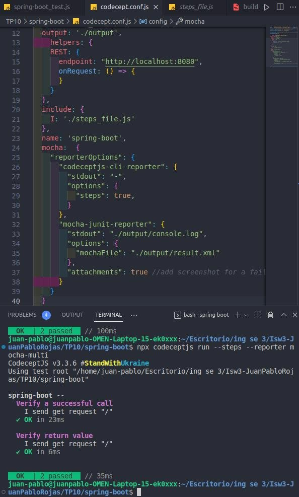

**Trabajo Práctico 10 - Pruebas de Integración**

**1- Objetivos de Aprendizaje**

- Adquirir conocimientos sobre conceptos referidos a pruebas de integración (integration tests).
- Generar y ejecutar pruebas de integración utilizado frameworks de código abierto.

**2- Unidad temática que incluye este trabajo práctico**

Este trabajo práctico corresponde a la unidad Nº: 5 (Libro Ingeniería de Software: Cap 8)

**3- Consignas a desarrollar en el trabajo práctico:**

**Conceptos generales explicaciones de los mismos Pruebas de integración**

Una prueba de integración tiene como objetivo probar el comportamiento de un componente o la integración entre un conjunto de componentes. El término prueba funcional se usa a veces como sinónimo para prueba de integración. Las pruebas de integración comprueban que todo el sistema funciona según lo previsto, por lo que reducen la necesidad de pruebas manuales intensivas.

Este tipo de pruebas le permiten traducir sus historias de usuario en un conjunto de pruebas. La prueba se asemejaría a una interacción esperada del usuario con la aplicación.

**Frameworks de pruebas**

Existen una gran variedad de herramientas o frameworks disponibles para las pruebas de integración, tanto para componentes del backend como del frontend. Estas pueden ser comerciales, de código abierto o desarrolladas y utilizadas internamente por las compañías de software.

Para este trabajo práctico vamos a probar aplicaciones web y rest y para ello utilizaremos Codeceptjs como ejemplo.

**Selenium**

Selenium es una herramienta de prueba de software automatizada y de código abierto para probar aplicaciones web. Tiene capacidades para operar en diferentes navegadores y sistemas operativos. Selenium es un conjunto de herramientas que ayuda a los testers a automatizar las aplicaciones basadas en la web de manera más eficiente.

Podemos codificar las pruebas directamente en un lenguaje de programación, por ejemplo javascript y ejecutarlas como parte del proceso de CI/CD.

**Codeceptjs[ https://codecept.io/**](https://codecept.io/)**

Codeceptjs es un framework end to end para pruebas de integración y de aceptación de usuario, es muy simple de usar y abstrae al que escribe los tests de trabajar directamente con el driver de Selenium o algún otro driver.

**4- Desarrollo:**

**- Familiarizarse con CodeceptJs**

- El objeto **I** y sus funcionalidades básicas:[ https://codecept.io/basics](https://codecept.io/basics)

**2- Testeando la página de GitHub**

- Instalar NodeJs v12 o superior:[ https://nodejs.org/en/download/](https://nodejs.org/en/download/)
- En un directorio, por ejemplo **.\proyectos\ut** ejecutar:

- Si esta utilizando codeceptjs 3.0.0, hay que actualizar a uno superior, por ejemplo 3.0.1

- Cambiar en packages.json "codeceptjs": "^3.0.0", por "codeceptjs": "^3.0.1", y ejecutar npm install
- Ininicializar un nuevo proyecto CodeceptJS:

Elegimos las opciones por defecto, ponemos **github** cuando se nos pregunte por el nombre del primer test:

- Editar el archivo generado:

- Finalmente correr el test: npx codeceptjs run --steps
- Agregamos otras validaciones

- Para generar selectores fácilmente utilizamos plugins como (Firefox o Chrome)
- TruePath[ https://addons.mozilla.org/en-US/firefox/addon/truepath/](https://addons.mozilla.org/en-US/firefox/addon/truepath/)
- 
- ChroPath [https://chrome.google.com/webstore/detail/chropath/ljngjbnaijcbncmcnjfhigeb omdlkcjo](https://chrome.google.com/webstore/detail/chropath/ljngjbnaijcbncmcnjfhigebomdlkcjo)

**3- Testeando la aplicación spring-boot**

- En un directorio, por ejemplo **.\proyectos\spring-boot-it** ejecutar:

- Instalar CodeceptJS con la librería webdriverio npm install codeceptjs chai --save-dev
- Inicializar CodeceptJS: npx codeceptjs init
- Responder las preguntas. Aceptar valores por defecto. Cuando pregunte por url colocar http://localhost:8080 y y el nombre de los tests poner spring-boot
- Editar el archivo generado spring-boot\_tests.js:

Reemplazar la sección helpers de codecept.conf.js por:

Levantar la aplicación spring-boot en otra consola (usando java o Docker):

Ejecutar los tests desde la carpeta .\proyectos\spring-boot-it

- Analizar resultados

Vemos que conceptjs nos permite ver y correr test en los browsers, a traves de  requests, en este caso le tiramos y en el archivo de configuracion, le brindamos los datos de la url , para utilizar los helpers y pegarle en distintas request y nuevamente trstear

**4- Habilitar reportes para utilizarlos en CICD**

- Instalar el módulo para reporting

Reemplazar la key mocha en el archivo codecept.conf.js por:

Ejecutar los tests nuevamente

- La salida compatible con Jenkins esta en ./output/results.xml

**5- Integrar la ejecución en Jenkins**

- Utilizando la funcionalidad de Junit test en Jenkins colectar estos resultados de la ejecución después del deployment.

