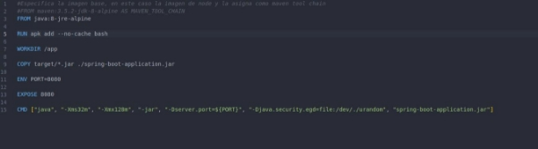
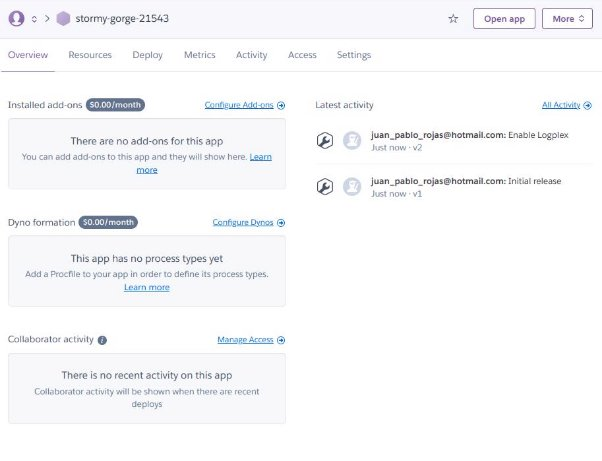
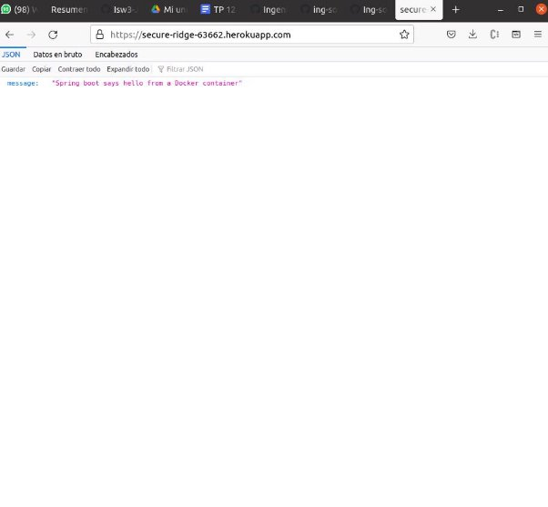
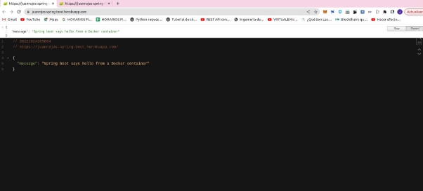

**Trabajo Práctico 12 - Despliegue de aplicaciones**

**1- Objetivos de Aprendizaje**

- Adquirir conocimientos acerca de las herramientas de despliegue y releases de aplicaciones.
- Configurar este tipo de herramientas.

**2- Unidad temática que incluye este trabajo práctico**

Este trabajo práctico corresponde a la unidad Nº: 3 (Libro Continuous Delivery: Cap 10)

**3- Consignas a desarrollar en el trabajo práctico:**

- Los despliegues (deployments) de aplicaciones se pueden realizar en diferentes tipos de entornos
  - On-Premise (internos) es decir en servidores propios.
  - Nubes Públicas, ejemplo AWS, Azure, Gcloud, etc.
  - Plataformas como servicios (PaaS), ejemplo Heroku, Google App Engine, etc
- Para este práctico utilizaremos como ejemplo a Heroku

**4- Desarrollo:**

**1- Configurando Heroku**

- Crear una cuenta en Heroku[ https://dashboard.heroku.com](https://dashboard.heroku.com)
- Instalar la utilidad de línea de comando de Heroku: <https://devcenter.heroku.com/articles/heroku-cli>
- Abrir una línea de comandos y registrase con la aplicación CLI

heroku login

heroku container:login

**2- Creando y Desplegando la aplicación Payroll**

- Modificar el archivo Dockerfile de nuestra aplicación para que sea compatible con Heroku (necesitamos definir una variable de entorno para el puerto donde correrá el servicio):

FROM java:8-jre-alpine

RUN apk add --no-cache bash

WORKDIR /app

COPY target/\*.jar ./spring-boot-application.jar ENV PORT=8080

EXPOSE 8080

CMD ["java", "-Xms32m", "-Xmx128m", "-jar", "-Dserver.port=${PORT}", "-Djava.security.egd=file:/dev/./urandom", "spring-boot-application.jar"]

- Abrir una línea de comandos y cambiar el directorio a donde se encuentra nuestra aplicación

cd ./proyectos/spring-boot

- Crear una nueva aplicación en Heroku

heroku create

- Esto creara un aplicación con un nombre determinando, por ejemplo **https://secure-ridge-63662.herokuapp.com/**

**●**

- 
- Generar y subir la imagen de Docker al registry de Heroku, desde este registry se desplegará la aplicación en Heroku

heroku container:push web --app=**secure-ridge-63662**

- Una vez terminada la operación, procedemos a desplegar la aplicación

heroku container:release web --app=**secure-ridge-63662**

- Nuestra aplicación estará ahora disponible en [https://](https://mysterious-fortress-63523.herokuapp.com/)**secure-ridge-63662.[herokuapp.com/](https://mysterious-fortress-63523.herokuapp.com/)**
- mysterious-fortress-63523
- 

$ curl https://secure-ridge-63662.herokuapp.com/ {"message":"Spring boot says hello from a Docker container"} $

- Con esto vemos que está retornando el mensaje esperado.

**3- Integrar el despliegue en Jenkins**

- Agregar un Job o un Stage para desplegar la aplicación en Heroku
- Ejecutar los tests de Integración / UAT desde Jenkins y colectar los resultados utilizando esta instancia de la aplicación.

// Sets global variable for using docker image // in multiple stages (build & prod)

def newImage

def herokuApp = "juanrojas-spring-boot"

pipeline {

agent any

tools {

// Install the Maven version configured as "M3" and add it to the path. maven "M3"

} stages {

stage('Build') {

steps {

// Get some code from a GitHub repositor

git branch: "main", url: 'https://github.com/juanrojas09/Isw3-JuanPabloRojas.git/'

sh "ls"

dir('./TP12/spring-boot') {

sh "mvn clean test"

//sh("mvn clean package spring-boot:repackage")

// Run Maven on a Unix agent.

sh "mvn -Dmaven.test.failure.ignore=true clean package"

}

}

post {

// If Maven was able to run the tests, even if some of the test // failed, record the test results and archive the jar file. success {

dir('TP12/spring-boot') {

archiveArtifacts 'target/\*.jar'

}

}

}

}

//  stage("Docker Image Build") {

// steps {

// dir('TP12/spring-boot') {

// script {

// Builds new docker image named ''

//  newImage = docker.build("juanrojas/spring-boot-jenkins:lastest") // }

//}

//}

//}

stage("Docker Image Post") { steps {

script {

DOCKER\_CREDS = credentials('0e549c42-67a5-4259-b7d4-3b5ed0bf0209')

withCredentials([usernamePassword( credentialsId: '0e549c42-67a5-4259-b7d4-3b5ed0bf0209', usernameVariable: 'DOCKER\_CREDS\_USR' , passwordVariable: 'DOCKER\_CREDS\_PSW')]) {

docker.withRegistry('', '0e549c42-67a5-4259-b7d4-3b5ed0bf0209') {

// logins into docker using credentials stored inside Jenkins credentials manager

sh 'docker login -u ${DOCKER\_CREDS\_USR} -p

${DOCKER\_CREDS\_PSW}'

sh('echo "Start session"')

// push image built into docker-hub with two tags:

// one with the actual build number (Jenkins job build #) dir('./TP12/spring-boot'){

newImage = sh 'docker build -t "heroku" .'

sh 'docker tag heroku juanrojas09/heroku:latest' sh 'docker push juanrojas09/heroku:latest'

}

//  newImage.push("${env.BUILD\_NUMBER}") // the other one as latest //newImage.push("juanrojas09/heroku:latest")

//sh 'docker push juanrojas/spring-boot-jenkins:lastest' }

}

} }

}

stage("Docker Image Test") { steps {

script {

// newImage.inside { sh('echo "Test passed"') //}

} } }

stage('Heroku Push and Deploy') {

steps {

dir('TP12/spring-boot') {

// sh "heroku create $herokuApp"

sh "heroku container:push web --app=$herokuApp" sh "heroku container:release web --app=$herokuApp" }

}

}

stage('Install Dependencies') {

steps {

dir('TP12/spring-boot-it') {

sh "npm install"

sh "npm i mocha-junit-reporter mocha-multi --save" }

}

}

stage('Run Integration Tests') {

steps {

dir('TP12/spring-boot-it') {

sh "npx codeceptjs run --steps --reporter mocha-multi" }

}

}

stage('Collect Integration Tests Report') { steps {

dir('TP12/spring-boot-it/output') {

junit 'result.xml'

}

}

}

}

}

