**Herramientas de construcción de software**

**1- Instalar Java JDK si no dispone del mismo.**

**2- Instalar Maven**

**3- Que es maven?**

- Es una herrmanienta de software para la gestion y construccion de proyectos java, posee la capacidad de realizar diferentes tareas, como compilacion y empaquetado del codigo, hace posible la creacion de software con dependencias incluidas dentro de la estructura jar, se definen las dependencias en un archivo POM.xml que se nombrara en consignas siguientes.

**Que es POM?**

- POM, sus siglas Project Object Model, es una representación XML de un proyecto en Maven, donde contiene la información del proyecto, como configuraciones para la compilación, dependencias que se instalen en el proyecto de librerías externas.

**1.modelVersion**

- Contiene la versión del modelo de POM

**2.groupId**

- Define el dominio del proyecto que estamos realizando, se divide en varios segmentos, el primer segmento es el dominio, gralmente en org,**com**,cn, etc, depende el fin de la organizacion, basicamente es el proyecto al cual pertenece el proyecto maven actual, los artifact tienen un groupID

**3.artifactID**

- Define el modulo maven, es el nombre del jar sin incluir la version.

**4.versionID**

- La versión del artifact.

- Los anteriores nombrados en conjunto forman el artifact.

●

**Repositorios Local, Central y Remotos [http://maven.apache.org/guides/introduction/introduction-to-repositories.html**](http://maven.apache.org/guides/introduction/introduction-to-repositories.html)**

- **Repositorio Local:** los repositorios locales son directorios que estan en la computadora donde se corre maven,cachea las descargas remotas y contiene los artifacts de compilación temporales
- **Repositorio remoto:** Cualquier otro repositorio que se accede por protocolos  como file:// y https://. Cuando se necesita un artifact de estos repos, se descarga el repositorio local del desarrollador y después se utiliza.
- **Repositorio Central:** esta localizado en <http://repo.maven.apache.org/maven2/>, cuando este compila, maven encuentra la dependencia en el repo local y si no se encuentra ahi, lo descarga desde este repositorio central.
- **Entender Ciclos de vida de build**

**-default:** Maneja el despliegue del proyecto**,** ejecuta una secuencia de fases para completar el ciclo default.

**-clean:** realiza una limpieza del proyecto, elimina archivos generados y luego hace el despliegue

**-site:** Crea la web del proyecto

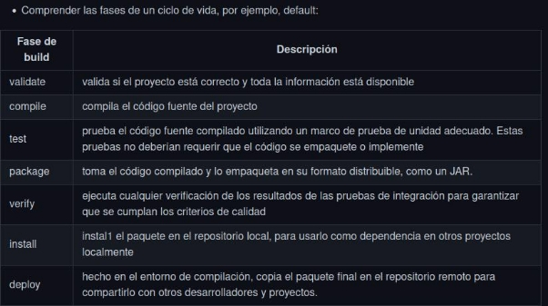

- **Copiar el siguiente contenido a un archivo, por ejemplo ./trabajo-practico-02/maven/vacio/pom.xml**

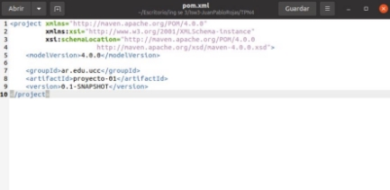

- **Ejecutar el siguiente comando en el directorio donde se encuentra el archivo pom.xml 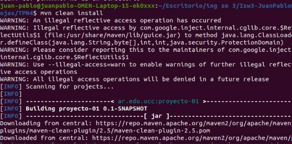**

- **Sacar conclusiones del resultado:**

Vemos que se ejecuta una fase de clean al proyecto y después comienza la compilación del mismo, desde 0, luego desde el repo central se descargaron una serie de archivos y se crea el proyecto de maven.

en el screen de arriba podemos ver lso archivos que se crearon apartir del clean ejecutado hacia el pom.xml, donde apartir del artifact que se almacena en un repo, si tiramos el clean, despues me va a hacer un build del proyecto con esa configuración del pom.xml y me lo va a descargar en mi directorio.

Entonces,El siguiente comando **mvn clean install** hace que maven haga un clean de todos los módulos antes de ejecutar el install action para los módulos, entonces limpia cualquier archivo compilado que tengas asi te aseguras que realmente estas compilando de 0. Luego despues de la limpieza, me instalo

**4- Maven Continuación**

- Generar un proyecto con una estructura inicial:

mvn archetype:generate -DgroupId=ar.edu.ucc -DartifactId=ejemplo -DarchetypeArtifactId=maven-archetype-quickstart -DinteractiveMode=false

**Analizar la estructura de directorios generada:**

- **Compilar el proyecto mvn clean package**

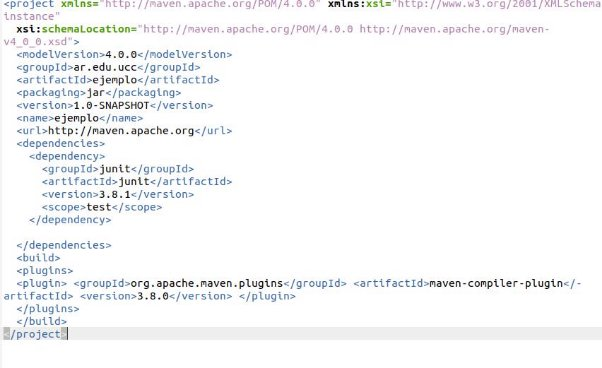

tuve que hacer un downgrade en la versión de jdk, sacado de un foro de git issues

- You are using JDK9 or later
- Your project uses **maven-compiler-plugin** with an old version which defaults to Java 5.

You have three options to solve this

1. Downgrade to **JDK7** or **JDK8** (meh)
1. Use **maven-compiler-plugin** version or later, because

output de compilar el proyecto:

- **Analizar la salida del comando anterior y luego ejecutar el programa**

Se corren los tests, se descargaron algunos archivos del repo central, se creo un target **java -cp target/ejemplo-1.0-SNAPSHOT.jar ar.edu.ucc.App**

***Este comando imprime "Hello world!"***

**6- Manejo de dependencias**

- **Crear un nuevo proyecto con artifactId ejemplo-uber-jar**

**mvn archetype:generate -DgroupId=ar.edu.ucc -DartifactId=ejemplo-uber.jar -DarchetypeArtifactId=maven-archetype-quickstart -DinteractiveMode=false**

- **Modificar el código de App.java para agregar utilizar una librería de logging:**
- **Compilar el código e identificar el problema. mvn clean package**

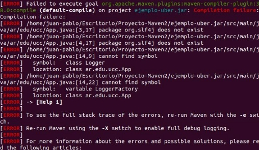

El problema es que en el output me dice que no se pudo encontrar el simbolo de la clase Logger ni LoggerFactory y la localización.

el problema es que no se agrego la dependencia al pom.xml **Podemos ver que en el directorio con el jar en su lugar**

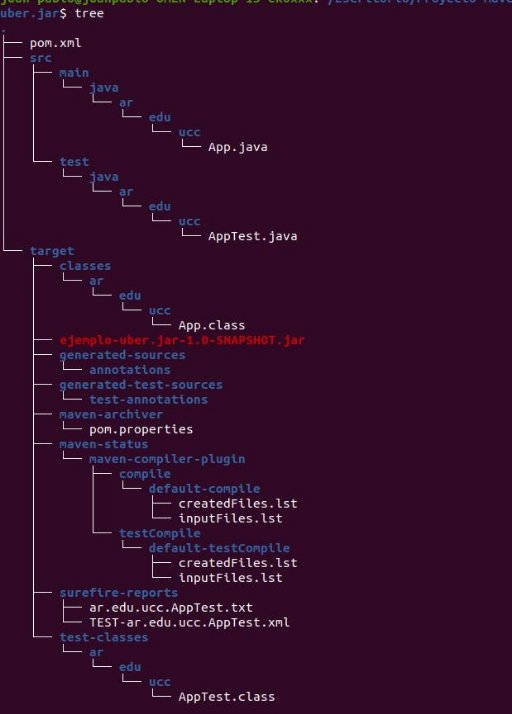

**java -cp target\ejemplo-uber-jar-1.0-SNAPSHOT.jar ar.edu.ucc.App**

- **Sacar concluciones y analizar la salida:**

**java -cp ejemplo-uber.jar-1.0-SNAPSHOT.jar ar.edu.ucc.App**

Podemos observar que por mas que hayamos añadido la dependencia en el ṕ,.xml, se intenta importar LoggerFactory que no se encuentra porque la especificación va a ser útil cuando se compile, entonces habria que buscar

la forma de vincular la clase. Una forma puede ser una forma de ejecutar no solo la app sino librerías y build del pom.xml que muchas veces nos aconseja el ide.

**Ahora, cjecutar la clase con el siguiente comando (en windows reemplazar $HOME por %USERPROFILE%, y separar por ; en lugar de :)**

**java -cp target/ejemplo-uber-jar-1.0-SNAPSHOT.jar:$HOME/.m2/repository/org/slf 4j/slf4j-api/1.7.22/slf4j-api-1.7.22.jar:$HOME/.m2/repository/ch/qos/logba ck/logback-classic/1.2.1/logback-classic-1.2.1.jar:$HOME/.m2/repository/ ch/qos/logback/logback-core/1.2.1/logback-core-1.2.1.jar ar.edu.ucc.App**

**en el comando de arriba cambie el nombre del jar que se crea salida:**

- **Implementar la opción de uber-jar: <https://maven.apache.org/plugins/maven-shade-plugin/>**

java -cp target\ejemplo-uber-jar-1.0-SNAPSHOT.jar ar.edu.ucc.App

ver porque no anda esta poronga **7- Utilizar una IDE**

**Importar el proyecto anterior en Eclipse o Intellij como maven project: En mi caso intelliji**

**Familiarizarse con la interfaz grafica**

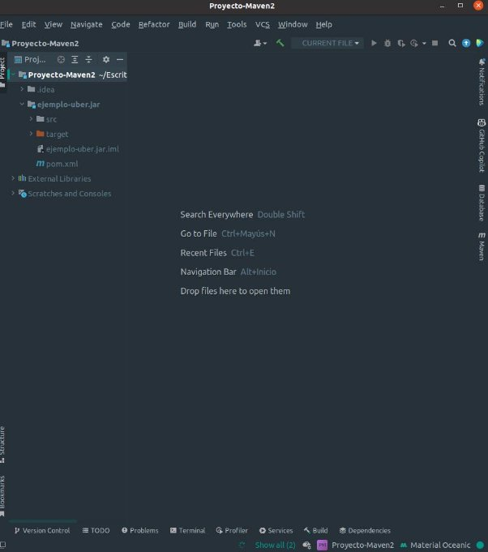

- **Ejecutar la aplicación**

-Para ejecutar la aplicación podemos ver al costado que tenemos una opcion de maven, en un momento me pregunto si queria cargar el jar

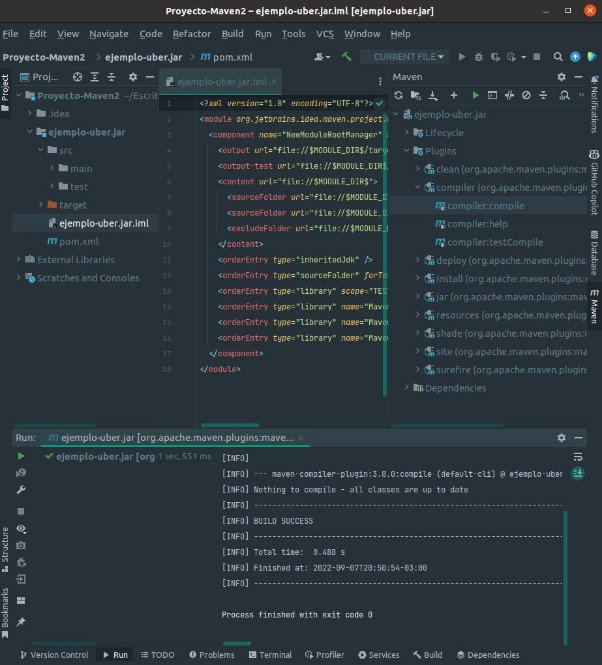

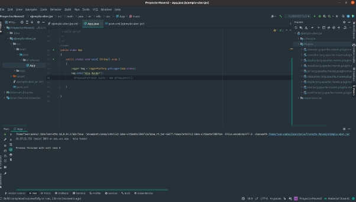

- **Depurar la aplicación**

**Podemos ver como debugueo la aplicacion al recorrer un array y puedo ver las variables y sus modificaciones.**

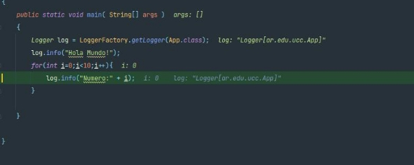

- **Correr unit tests y coverage**

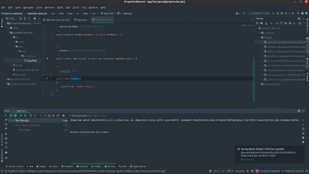

- **Ejecutar los goals de maven**

**Un Maven plugin se encarga de centralizar una serie de tareas que son comunes a la construcción del software y están fuertemente relacionadas . Así pues cada plugin dispone de varias tareas a ejecutar. Por ejemplo el plugin de Compile dispone de dos tareas a cada tarea se la denomina Maven Goal. En este caso la tarea de Compile que compila el código y la tarea o goal de TestCompile que compila la parte de Testting.**

- **Encontrar donde se puede cambiar la configuración de Maven.**
- **etc.**

**8- Ejemplo con nodejs**

**Instalar el componente para generar aplicaciones Express** npm install express-generator -g

**Crear una nueva aplicación** express --view=ejs hola-mundo

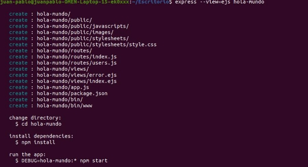

**La aplicación web estará disponible en[ http://localhost:3000**](http://localhost:3000)**

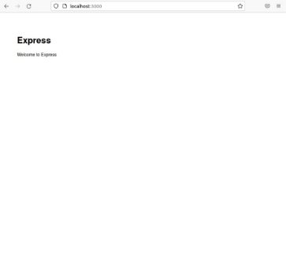

- **Analizar el manejo de paquetes y dependencias realizado por npm.**

**NPM** es un manejador de paquetes de node, tiene dos partes principales,

- Un repo online para publicar paquetes de software libre para ser utilizados en proyectos node.js.
- Una herramienta para la terminar para interactuar con el repositorio que permita la instalación de utilidades, manejo de dependencias y la publicación de paquetes

En cada proyecto que utilizamos npm, vamos a tener un archivo package.json que contendrá la información del proyecto, este se genera cuando se empieza a tratar con npm.

entonces tenemos Repo central → autores de paquetes y consumidores de paquetes, en el medio de esta esta el npm CLI o consola encargada de instalar, publicar y manejar dependencias, etc.

**en nuestro caso en el proyecto que se utilizo NPM tenemos lo siguiente:**

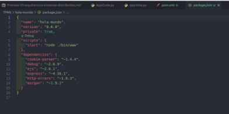

**9- Ejemplo con python**

**Instalar dependencias (Ejemplo Ubuntu) varía según el OS:** sudo apt install build-essential python3-dev

pip3 install cookiecutter

**Correr el scaffold**

$ cookiecutter https://github.com/candidtim/cookiecutter-flask-minimal.git application\_name [Your Application]: test

package\_name [yourapplication]: test

$

**Ejecutar la aplicación**

cd test make run

- **Acceder a la aplicación en:[ http://localhost:5000/**](http://localhost:5000/)**
- **Explicar que hace una tool como cookiecutter, make y pip.**
- **cookiecutter:** Este nos proporciona una interfaz grafica de usuario para descubrir plantillas, opciones de plantilla de entrada y crear proyectos y archivos.
- **Make:** Make sirve para construir programas, este nos muestra que partes del programa necesitan ser compiladas para levantarse, es decir contiene las ordenes que debe ejecutar la utilidad make, como las dependencias entre los distintos modulos.

en nuestro proyecto de test podemos ver el contenido del mismo:

- **pip:** es una herramienta de linea de comando que permite administrar paquetes, instalar, reinstalar y desinstalar paquetes de python.

**10- Build tools para otros lenguajes**

- Hacer una lista de herramientas de build (una o varias) para distintos lenguajes, por ejemplo (Rust -> cargo)
- Elegir al menos 10 lenguajes de la lista de top 20 o top 50 de tiobe: <https://www.tiobe.com/tiobe-index/>

C# → Essential MSbuild

C++ → Make, Cmake

JavaScript → WebPack

Go → go build,Task

Php →Phing

java →Ant,Maven,Gradle

Perl → Perl Build System

Swift → Swift Package Mananger C → Cheesmake

.Net Framework → NAnt

Groovy → Gradle
