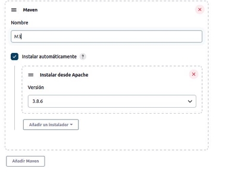
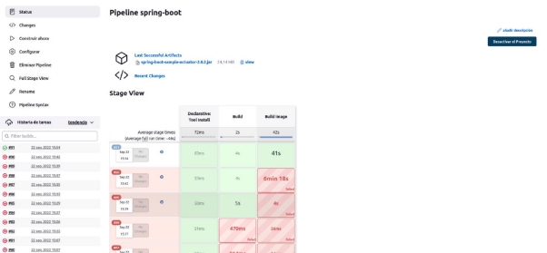
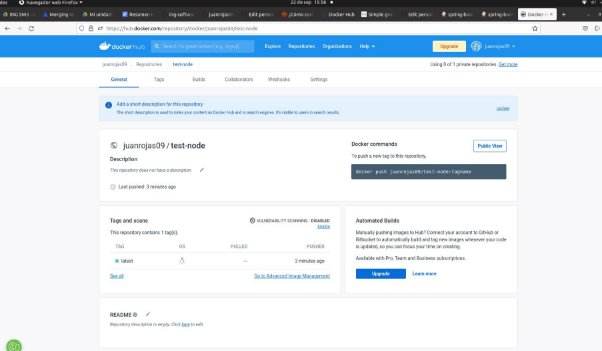

**Trabajo Práctico 7 - Servidor de Build (de integración continua).**

**1- Objetivos de Aprendizaje**

- Adquirir conocimientos acerca de las herramientas de integración continua.
- Configurar este tipo de herramientas.
- Implementar procesos de construcción automatizado simples.

**2- Unidad temática que incluye este trabajo práctico**

Este trabajo práctico corresponde a la unidad Nº: 3 (Libro Continuous Delivery: Cap 3)

**3- Consignas a desarrollar en el trabajo práctico:**

- Para una mejor evaluación del trabajo práctico, incluir capturas de pantalla de los pasos donde considere necesario.

**4- Desarrollo:**

**1- Poniendo en funcionamiento Jenkins**

- Bajar la aplicación y ejecutarla (ejemplo para Linux):

export JENKINS\_HOME=~/jenkins

mkdir -p $JENKINS\_HOME cd $JENKINS\_HOME

wget http://mirrors.jenkins.io/war-stable/latest/jenkins.war

java -jar jenkins.war --httpPort=8081

pass 27dc5a1660f245009b4c1e02abb63db9

- Se puede también ejecutar en contenedor de Jenkins (pero para construir imágenes de Docker, el proceso se complica un poco):
- Una vez en ejecución, abrir[ http://localhost:8081](http://localhost:8081)
- Inicialmente deberá especificar el texto dentro del archivo ~/jenkins/secrets/initialAdminPassword

cat ~/jenkins/secrets/initialAdminPassword

- Instalar los plugins por defecto

- Crear el usuario admin inicial. Colocar cualquier valor que considere adecuado.

- Se aconseja perisistir la variable **JENKINS\_HOME**, ya sea por ejemplo en .bashrc o en las variables de entorno de Windows.
- 

**2- Conceptos generales**

- Junto al Jefe de trabajos prácticos:
- Explicamos los diferentes componentes que vemos en la página principal:
- En la pagina principal tenemos varias opciones, en el lado izquierdo tenemos un panel de control que nos muestra:
- **○**
- **nueva tarea:** muestra como crear nuevos procesos,items,jobs,pipelines y determina como va a actuar jenkins ante algun cambio
- 
- **Personas:** se pueden administrar y gestionar lls usuarios conocidos, identidades con acceso al dominio de seguridad actual, etc
- 
- **Historial de construccion:** lleva a cabo un registro de las tareas ejecutadas de jenkins.
- **Administrar jenkins:** sirve para configurar el sistema, configurar herramientas e instalaciones, nodos, plugins, administracion en base a la seguridad, el estado de la informacion, logs, trouble shooting, acciones y herramientas a llevar a cabo
- 
- 
- Analizamos las opciones de administración de Jenkins

**3- Instalando Plugins y configurando herramientas**

- En Administrar Jenkins vamos a la sección de Administrar Plugins
- 
- De la lista de plugins disponibles instalamos **Docker Pipeline**
- 
- Instalamos sin reiniciar el servidor.
- 
- Abrir nuevamente página de Plugins y explorar la lista, para familiarizarse qué tipo de plugins hay disponibles.
- 
- En la sección de administración abrir la opción de configuración de herramientas
- Agregar maven con el nombre de **M3** y que se instale automáticamente.
- 

**4- Creando el primer Pipeline Job**

- Crear un nuevo item, del tipo Pipeline con nombre **hello-world**
-  ****
- Una vez creado el job, en la sección Pipeline seleccionamos **try sample Pipeline** y luego **Hello World**
- 
- Guardamos y ejecutamos el Job
- 
- Analizar la salida del mismo
- 
- 

**5- Creando un Pipeline Job con Git y Maven**

- Similar al paso anterior creamos un ítem con el nombre **simple-maven**
- 
- Elegir **Git + Maven** en la sección **try sample Pipeline**
- 
- Guardar y ejecutar el Job
- Analizar el script, para identificar los diferentes pasos definidos y correlacionarlos con lo que se ejecuta en el Job y se visualiza en la página del Job.
- 
- Script: stage view, vemos dos stages, el declarative y el build, en el build instala maven mediante la herramienta definida anteriormente M3 que instalaba el recurso automáticamente, luego hace fech y se baja el proyecto de test de maven desde github, después corre maven (comienza la parte de post del script) y guarda los resultados del test mediante junit(sirve para tests, como xunit) con los resultados y por ultimo guarda los archivos que se generaron en la carpeta target en jenkins para después usarlos, en archiveArtifacts
- **Resultado:**
- 

**6- Utilizando nuestros proyectos**

- Utilizando lo aprendido en el ejercicio 5
- Crear un Job que construya el proyecto **spring-boot** del[ trabajo práctico 6](https://github.com/fernandobono/ing-software-3/blob/master/trabajos/06-construccion-imagenes-docker.md).
- Obtener el código desde el repositorio de cada alumno (se puede crear un repositorio nuevo en github que contenga solamente el proyecto maven).
- En mi caso cree un repo con lo que necesiataba
- 
- Generar y publicar los artefactos que se producen.
- Como resultado de este ejercicio proveer el script en un archivo **spring-boot/Jenkinsfile**

**despues de un par de intentos, solucionando el problema de mi git y mis credenciales, salio.**

**7- Utilizando nuestros proyectos con Docker**

- Extender el ejercicio 6
- Generar y publicar en Dockerhub la imagen de docker además del Jar.
- Se puede utilizar el[ plugin de docker](https://docs.cloudbees.com/docs/admin-resources/latest/plugins/docker-workflow) o comandos de shell.
- No poner usuario y password en el pipeline en texto plano, por ejemplo para conectarse a DockerHub, utilizar[ credenciales de jenkins](https://github.com/jenkinsci/credentials-plugin/blob/master/docs/user.adoc) en su lugar.
- Como resultado de este ejercicio proveer el script en un archivo **spring-boot/Jenkinsfile**
- Referencia: [https://tutorials.releaseworksacademy.com/learn/building-your-first-docker-image-with -jenkins-2-guide-for-developers](https://tutorials.releaseworksacademy.com/learn/building-your-first-docker-image-with-jenkins-2-guide-for-developers)
  - En el script trate de usarlo con el plugin de docker pero tardaba mucho entonces use sh y los comandos usados en el anterior tp para subirlo a docker hub y buildear la imagen

- Podemos ver que se pusheo la imagen en docker hub y aparece con una actualización de hace 3 minutos.
- 
