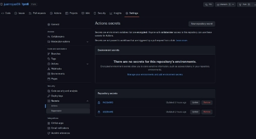

**Trabajo Práctico 8 - Herramientas de construcción de software en la nube**

**1- Objetivos de Aprendizaje**

- Adquirir conocimientos acerca de las herramientas de integración continua en la nube.
- Configurar este tipo de herramientas.
- Implementar procesos simples de construcción automatizada.

**2- Unidad temática que incluye este trabajo práctico**

Este trabajo práctico corresponde a la unidad Nº: 3 (Libro Continuous Delivery: Cap 3)

**3- Consignas a desarrollar en el trabajo práctico:**

- Para una mejor evaluación del trabajo práctico, incluir capturas de pantalla de los pasos donde considere necesario.
- En este caso existen varias herramientas con funcionalidades similares en la nube:
- [GitHub Actions](https://github.com/actions)
- [CircleCI](https://circleci.com/)
- [Travis CI](https://travis-ci.com/)
- [Codefresh](https://codefresh.io/)
- [Gitlab](https://about.gitlab.com/) - Trial de 30 días

**4- Desarrollo:**

**1- Pros y Contras**

- Listar los pros y contras de este tipo de herramientas
- Estas herramientas ofrecen servicios similares , pero tienen diferencias
- **Pros:**
- **Github actions**
- **Flexibilidad**
- **Integrada en github, no requiere un site externo**
- **Probar configuraciones de varios contenedores de docker**
- **Contras**
- **Github actions**
  - **Se corre el riesgo de compartir secretos de forma insegura, si no usamos las herramientas para no corres estos riesgos.**
  - **no se puede disparar una tarea simple de un flujo.**
  - **Disponibilidad**
  - **Bajo control**
- Sacar conclusiones

**2- Configurando GitHub Actions**

- Repetir el ejercicio 6 del trabajo práctico[ trabajo práctico 7](https://github.com/fernandobono/ing-software-3/blob/master/trabajos/07-servidor-build.md) para el proyecto **spring-boot**, pero utilizando GitHub Actions.
- En GitHub, en el repositorio donde se encuentra la aplicación **spring-boot**, ir a la opción **Actions** y crear un nuevo workflow.
- 
- 
- El nombre de archivo puede ser build.xml y tendrá un contenido similar al siguiente

(el path donde se encuentra el código puede ser diferente):

- 

Codigo

- Guardar el archivo (hacemos commit directamente en GitHub por ejemplo) y ejecutamos manualmente el pipeline.
- 
- 
- Explicar que realiza el pipeline anterior.
- Podemos ver como funciona la herramienta de actions de github, donde

podemos crear un archivo para crear un workflow y poder crear el script para

realizar la integración continua, lo que podemos ver en el script de arriba es

como, determinamos la rama con sus paths,  con workflow\_dispatch nos

permite correr el workflow manual.

- jobs: los jobs serian como los stage de jenkins, se pueden correr de forma secuencial o paralela, en este caso tenemos el build, con sus steps, chequea

el repositorio, instala java y hace build de maven.

**3- Utilizando nuestros proyectos con Docker**

- Repetir el ejercicio 7 del trabajo práctico[ trabajo práctico 7](https://github.com/fernandobono/ing-software-3/blob/master/trabajos/07-servidor-build.md), pero utilizando GitHub Actions.
- Generar secretos y los pasos necesarios para subir la imagen a Docker Hub. [Referencia](https://github.com/actions/starter-workflows/blob/main/ci/docker-publish.yml)
- Para encriptar los datos de mi contraseña y username en github actions, use github secrets, donde cree dos repositorios secretos con ambos datos y de ahí los utilizo con secrets.
- 

○

**4- Opcional: Configurando CircleCI**

- De manera similar al ejercicio 2, configurar un build job para el mismo proyecto, pero utilizando CircleCI
- Para capturar artefactos, utilizar esta referencia: <https://circleci.com/docs/2.0/artifacts/>
- Como resultado de este ejercicio, subir el config.yml a la carpeta **spring-boot**

**5- Opcional: Configurando TravisCI**

- Configurar el mismo proyecto, pero para TravisCI. No es necesario publicar los artefactos porque TravisCI no dispone de esta funcionalidad.
- Como resultado de este ejercicio subir el archivo .travis.yml a la carpeta **spring-boot**

**6- Opcional: Configurando Codefresh**

- Configurar el mismo proyecto, pero para Codefresh.
- Como resultado de este ejercicio subir el archivo codefresh.yml a la carpeta **spring-boot**

**7- Opcional: Configurando Gitlab**

- Configurar el mismo proyecto, pero para Gitlab.
- Como resultado de este ejercicio subir el archivo .gitlab-ci.yml a la carpeta **spring-boot**
