**Trabajo Práctico 9 - Pruebas de unidad 1- Objetivos de Aprendizaje**

- Adquirir conocimientos sobre conceptos referidos a pruebas de unidad (unit tests).
- Generar y ejecutar pruebas unitarias utilizado frameworks disponibles.

**2- Unidad temática que incluye este trabajo práctico**

Este trabajo práctico corresponde a la unidad Nº: 5 (Libro Ingeniería de Software: Cap 8)

**3- Consignas a desarrollar en el trabajo práctico:**

**Conceptos generales explicaciones de los mismos**

**¿Qué son las pruebas de software?**

Una prueba de software es una pieza de software que ejecuta otra pieza de software. Valida si ese código da como resultado el estado esperado (prueba de estado) o ejecuta la secuencia de eventos esperados (prueba de comportamiento).

**¿Por qué son útiles las pruebas de software?**

Las pruebas de la unidad de software ayudan al desarrollador a verificar que la lógica de una parte del programa sea correcta.

Ejecutar pruebas automáticamente ayuda a identificar regresiones de software introducidas por cambios en el código fuente. Tener una cobertura de prueba alta de su código le permite continuar desarrollando características sin tener que realizar muchas pruebas manuales.

**Código (o aplicación) bajo prueba**

El código que se prueba generalmente se llama código bajo prueba . Si está probando una aplicación, esto se llama la aplicación bajo prueba .

**Prueba unitarias (Unit Tests)**

Una prueba de unidad es una pieza de código escrita por un desarrollador que ejecuta una funcionalidad específica en el código que se probará y afirma cierto comportamiento o estado.

El porcentaje de código que se prueba mediante pruebas unitarias generalmente se llama cobertura de prueba.

Una prueba unitaria se dirige a una pequeña unidad de código, por ejemplo, un método o una clase. Las dependencias externas deben eliminarse de las pruebas unitarias, por ejemplo, reemplazando la dependencia con una implementación de prueba o un objeto (mock) creado por un framework de prueba.

Las pruebas unitarias no son adecuadas para probar la interfaz de usuario compleja o la interacción de componentes. Para esto, debes desarrollar pruebas de integración.

**Frameworks de pruebas unitarias para Java**

Hay varios frameworks de prueba disponibles para Java. Los más populares son JUnit y TestNG

**¿Qué parte del software debería probarse?**

Lo que debe probarse es un tema muy controvertido. Algunos desarrolladores creen que cada declaración en su código debe ser probada.

En cualquier caso, debe escribir pruebas de software para las partes críticas y complejas de su aplicación. Si introduce nuevas funciones, un banco de pruebas sólido también lo protege contra la regresión en el código existente.

En general, es seguro ignorar el código trivial. Por ejemplo, es inútil escribir pruebas para los métodos getter y setter que simplemente asignan valores a los campos. Escribir pruebas para estas afirmaciones consume mucho tiempo y no tiene sentido, ya que estaría probando la máquina virtual Java. La propia JVM ya tiene casos de prueba para esto. Si está desarrollando aplicaciones de usuario final, puede suponer que una asignación de campo funciona en Java.

Si comienza a desarrollar pruebas para una base de código existente sin ninguna prueba, es una buena práctica comenzar a escribir pruebas para el código en el que la mayoría de los errores ocurrieron en el pasado. De esta manera puede enfocarse en las partes críticas de su aplicación.

**4- Desarrollo:**

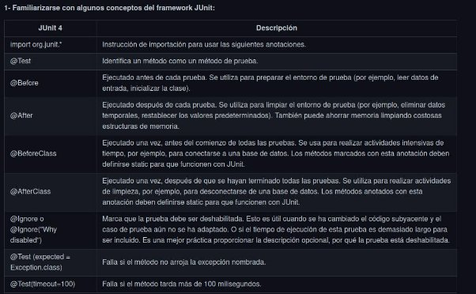

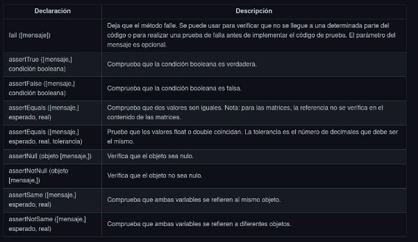

**1- Utilizando Unit test**

- ¿En el proyecto **spring-boot** para qué está esta dependencia en el pom.xml?

En el pom.xml esta dependencia spring-boot-starter-test es el modulo que testea la unidad de spring-boot

Analizar y ejectuar el metodo de unit test:

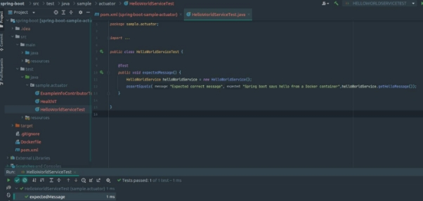

este test podemos ver que no devuelve nada, llama una instancia de helloworldservice y con el assert, en este caso equals, verificamos que espere el mismo mensaje que dice en el segundo parametro, como resultado los test pasaron, vemos el getter que coincide el mensaje.

- Ejecutar los tests utilizando la IDE

**3- Familiarizarse con algunos conceptos de Mockito**

Mockito es un framework de simulación popular que se puede usar junto con JUnit. Mockito permite crear y configurar objetos falsos. El uso de Mockito simplifica significativamente el desarrollo de pruebas para clases con dependencias externas.

Si se usa Mockito en las pruebas, normalmente:

1. Se burlan las dependencias externas e insertan los mocks en el código bajo prueba
1. Se ejecuta el código bajo prueba
3. Se valida que el código se ejecutó correctamente

Referencia:[ https://www.vogella.com/tutorials/Mockito/article.html ](https://www.vogella.com/tutorials/Mockito/article.html)Se leyo la documentación, se agrego la dependencia de mockito

- Analizar el código del test
- En los test que muestra la documentación, podemos ver como se implementa el framework de mockito, para mockear entidades y probar funcionalidad, en el caso de la documentacion mockea un contexto de una base de datos y tiene una funcion query, donde depende que devuelva esa funcion es si la db esta disponible o no, entonces luego se crea una clase de test donde se usa el mockito, con sus anotaciones, se mockea el contexto de la db y se realizan los correspondientes asserts
- 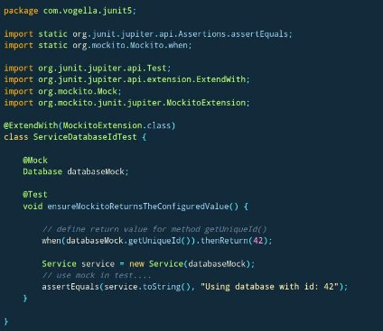
- Ejecutar los tests utilizando la IDE

**3- Familiarizarse con algunos conceptos de Mockito**

Mockito es un framework de simulación popular que se puede usar junto con JUnit. Mockito permite crear y configurar objetos falsos. El uso de Mockito simplifica significativamente el desarrollo de pruebas para clases con dependencias externas.

Si se usa Mockito en las pruebas, normalmente:

1. Se burlan las dependencias externas e insertan los mocks en el código bajo prueba
1. Se ejecuta el código bajo prueba
1. Se valida que el código se ejecutó correctamente

Referencia:[ https://www.vogella.com/tutorials/Mockito/article.html](https://www.vogella.com/tutorials/Mockito/article.html)

- Analizar el código del test

Primero podemos ver la clase test, donde vemos la funcion que se encargara de testear, en este caso se le asigna la anotacion test, se va a mockear la clase builder, instanciamos un exampleinfoContributor, llamamos la funcion contribute, que seguramente esta implementada en exampleContrubutor, pasandole como argumento el builder mockeado, se llama a verify pasandole el builder, **withDetail**(any,any), le paso una key y un  valor a lo que quiero registrar por lo que entiendo esta tratando con cualquier tipo de datos.

**4- Utilizando Mocks**

- Agregar un unit test a la clase **HelloWorldServiceTest**
- Cuando se llame por primera vez al método **getHelloMessage** retorne "Hola Hola"
- Cuando se llame por segunda vez al método **getHelloMessage** retorne "Hello Hello"
- 
- test

○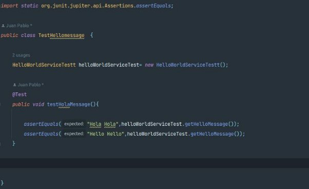

- Resultado del test

○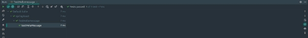

- Crear la siguiente clase **AbstractTest**

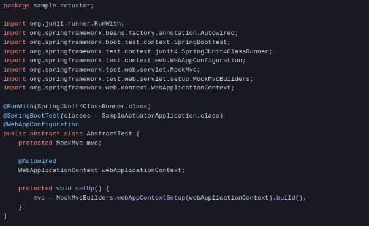

- **Agregar esta otra clase también en el mismo directorio**

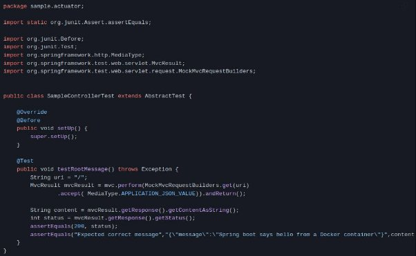

- Analizar estos tests

Primero se creo una clase abstracta llamada abstractTest, innstanciamos un tipo MockMvc que es una clase de spring que permite hacer peticiones http, luego con la anotacion autowired instanciamos un tipo webaplicationContext, el autowired sirve como si fuese una inyeccion de dependencias, lo que me permite usar los diferentes metodos de esa clase etc, declaramos un metodo setup que se ejecuta antes de cada test.

En el sampleControllerTest heredamos la clase anterior nombrada, le pasamos el metodo setUp, que se ejecuta antes de los test, luego se declara el metodo del test, con su notacion @Test  , declaramos la uri de la peticion , declaramos una variable de tipo MvcResult que llamando a su metodo perform nos permite hacer la peticion http, luego obtengo el response de la conexion y verifico con el assert que sea igual a 200.

Lo mismo con las siguientes lineas, esperando que el mensaje sea el que se esperado

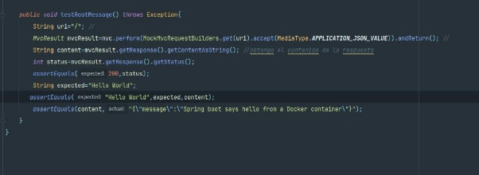

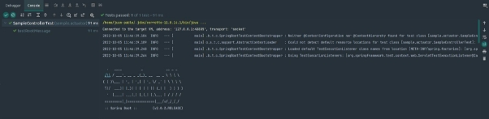

**5- Opcional: Agregar otros unit tests**

- Agregar unit tests para mejorar la cobertura, pueden ser test simples que validen getter y setters.

**6- Capturar los unit tests como parte del proceso de CI/CD**

- Hacer los cambios en Jenkins (o en la herramienta de CICD utilizada) si es necesario, para capturar los resultados de los unit tests y mostrarlos en la ejecución del build.
- 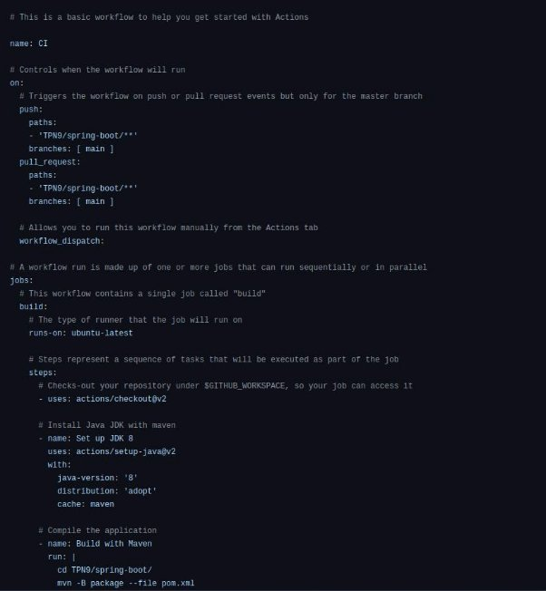
- En mi caso use github Actions, cree un workflow, con el siguiente codigo
- Una vez corrido el pipeline, podemos ver que se ejecutaron los tests probados, en este caso vemos que se corrio el test del metodo “Hello Hello”
- 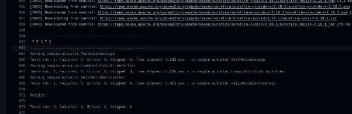
- 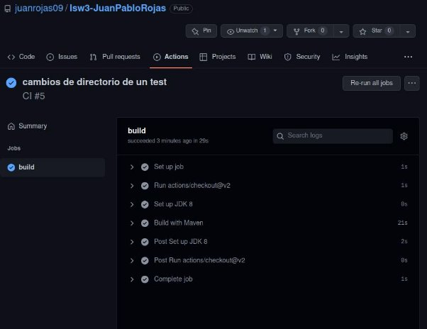
- 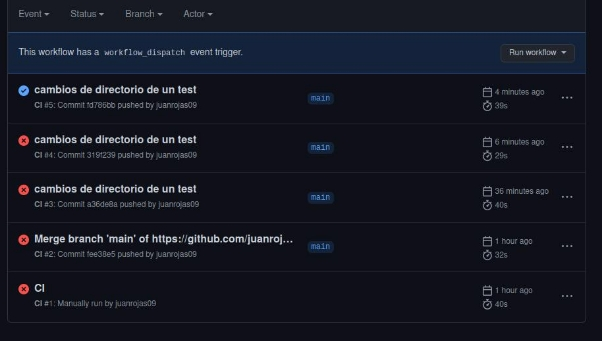
